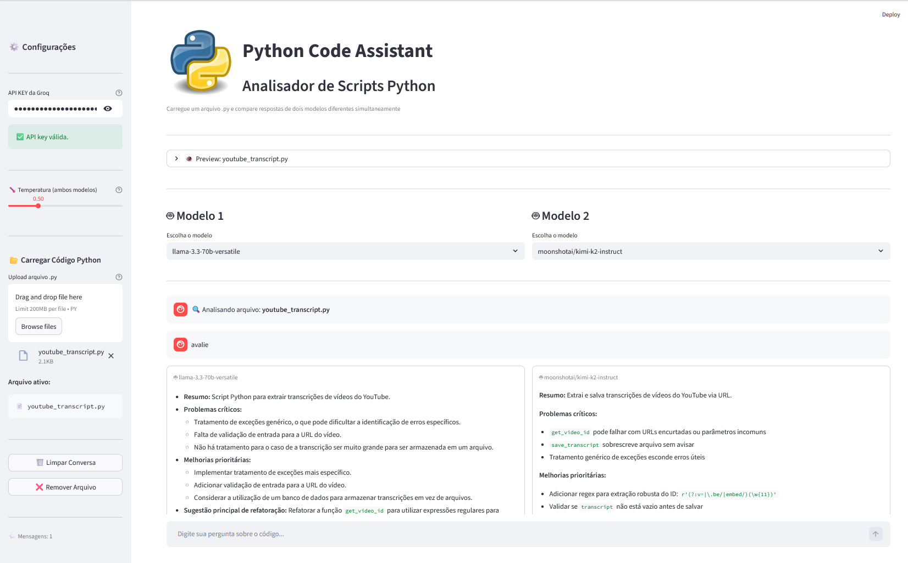

# biPy 

Compare respostas de dois modelos LLM simultaneamente para análise e revisão de código Python.



## Funcionalidades

- Upload de arquivos `.py` para análise automática
- Comparação lado a lado de dois modelos diferentes
- Streaming de respostas em tempo real
- Interface intuitiva com Streamlit

## Instalação
```bash
# Clone o repositório
git clone https://github.com/esscova/biPy.git
cd biPy

# Instale as dependências
uv sync
```

## Configuração

1. Obtenha sua API key da [Groq](https://console.groq.com/keys)
2. Execute a aplicação:
```bash
streamlit run main.py
```
3. Insira sua API key na sidebar
4. Faça upload de um arquivo `.py` e comece a usar!

## Tecnologias

- Python 3.11+
- Streamlit
- Groq API

## Contato

**Wellington Moreira Santos**
- LinkedIn: [wellington-moreira-santos](https://www.linkedin.com/in/wellington-moreira-santos/)
- Email: wsantos08@hotmail.com

---

⭐ Se este projeto foi útil, considere dar uma estrela no repositório!